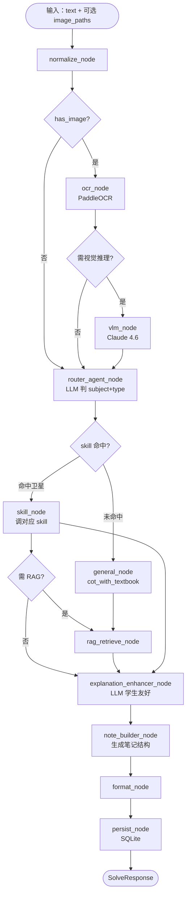

# Examsolver 后端架构 v1.0（B 路线）

> 本文档是工程施工前的**认知凝固件**。任何代码落地前，必须能追溯到本文档某一层、某一节、某一条契约。冲突时以本文档为准。

**配套**：
- [`VISION.md`](./VISION.md) — 北极星：产品身份与目的地
- [`CONVENTIONS.md`](./CONVENTIONS.md) — 代码层规约
- [`SKILL_PLAYBOOK.md`](./SKILL_PLAYBOOK.md) — 怎么写一颗卫星
- [`FRONTEND.md`](./FRONTEND.md) — 前端规约
- [`ROADMAP.md`](./ROADMAP.md) — 分阶段施工

**目录**：
0. 一句话定位
1. 同心圆（太阳系）总图
2. LangGraph 节点图
3. 八层职责边界
4. Solve Contract（太阳）
5. Skill 三型（卫星）
6. 多模态子系统
7. RAG 子系统（教材）
8. 笔记 / 错题本 / 卡片子系统
9. LLM Router（云 / 本地选择）
10. 目录结构
11. 错误与降级策略
12. 请求追踪
13. 红线与反模式
14. 接缝预留（v1.5+ 不做但留接口）

---

## 0. 一句话定位

Examsolver 是一条**由 LangGraph 编排、围绕 Solve Contract 展开、以同心圆 skill 为业务中心**的单题求解 + 笔记生成系统。LangGraph 是编排骨架，FastAPI 是 HTTP 壳，Next.js 是前端壳——三者都可替换，**skill 和契约不可替换**。

---

## 1. 同心圆（太阳系）总图

```
                       ┌──────────────────────────────────────────┐
                       │           Next.js 前端壳                 │  外壳，可替换
                       │  ┌────────────────────────────────────┐  │
                       │  │       FastAPI HTTP 壳              │  │  外壳，可替换
                       │  │  ┌──────────────────────────────┐  │  │
                       │  │  │   LangGraph 编排层           │  │  │  ← 骨架
                       │  │  │  ┌────────────────────────┐  │  │  │
                       │  │  │  │   Router Agent (LLM)   │  │  │  │  ← 分发器
                       │  │  │  │  ┌──────────────────┐  │  │  │  │
                       │  │  │  │  │  SKILL  LAYER    │  │  │  │  │  ← 业务中心（行星+卫星）
                       │  │  │  │  │ ┌──────────────┐ │  │  │  │  │
                       │  │  │  │  │ │ Solve Contract│ │  │  │  │  │  ← 太阳
                       │  │  │  │  │ └──────────────┘ │  │  │  │  │
                       │  │  │  │  └──────────────────┘  │  │  │  │
                       │  │  │  └────────────────────────┘  │  │  │
                       │  │  └──────────────────────────────┘  │  │
                       │  └────────────────────────────────────┘  │
                       └──────────────────────────────────────────┘
```

### 1.1 行星（subject）清单（v1.0）

机械系六行星，外加一个 `general/` 兜底：

| 行星 | 路径 | 起始卫星 | 备注 |
|---|---|---|---|
| `general` | `skills/general/` | `cot_with_textbook` | 兜底通用解题手，永远命中 |
| `calculus` | `skills/calculus/` | `derivative` `integral` `series` `ode` | 已有 `derivative` 起点 |
| `physics` | `skills/physics/` | `electromagnetism` `wave` `rigid_body` | 全新 |
| `mechanics_eng` | `skills/mechanics_eng/` | `force_balance` `truss` `torque` | 已有 `force_balance` 起点 |
| `mechanism` | `skills/mechanism/` | `gear_train` `crank_slider` `cam` | **VLM 重度使用** |
| `tolerance` | `skills/tolerance/` | `fit_type` `position_tolerance` | **RAG 重度使用** |
| `auto_theory` | `skills/auto_theory/` | `dynamics` `braking` `stability` | LLM 综合 |

### 1.2 卫星槽位预留

每个行星目录都有：
```
skills/<subject>/
├── __init__.py
├── _meta.py            # 行星元数据：display_name, color, icon, textbooks
├── _textbook/          # 该学科 RAG 资料（gitignore 内容，留目录）
│   └── .gitkeep
├── <type1>.py          # 卫星 1
├── <type2>.py          # 卫星 2
└── tests/              # 镜像 tests/ 结构
```

新增学科只需 `python scripts/new_skill.py <subject> <type>` 自动生成。

---

## 2. LangGraph 节点图

### 2.1 总图（mermaid）



### 2.2 节点职责一句话

| 节点 | 输入 | 输出 | 谁实现 |
|---|---|---|---|
| `normalize_node` | raw payload | NormalizedQuestion | `pipeline/normalizer.py`（保留旧实现，扩 image_paths）|
| `ocr_node` | image_paths | ocr_text + bbox | `multimodal/ocr_paddle.py` |
| `vlm_node` | image + 问题 | 视觉描述（"两级齿轮 z1=20..."）| `multimodal/vlm_claude.py` |
| `router_agent_node` | normalized + ocr + vision | (subject, question_type, confidence) | `graph/router_agent.py` |
| `skill_node` | normalized + 附加上下文 | SolveResult | `skills/<subject>/<type>.py` |
| `general_node` | normalized | SolveResult | `skills/general/cot_with_textbook.py` |
| `rag_retrieve_node` | query + subject | chunks[] | `rag/retriever.py` |
| `explanation_enhancer_node` | SolveResult | SolveResult + student_explanation | `services/explanation.py`（保留改造）|
| `note_builder_node` | SolveResult | NoteEntry（含易错点、相关公式、卡片）| `notes/note_builder.py` |
| `format_node` | NoteEntry | SolveResponse | `pipeline/formatter.py`（保留扩展）|
| `persist_node` | SolveResponse | 落 SQLite + 索引 | `storage/history_repo.py` + 新表 |

### 2.3 状态对象 `SolveState`

```python
class SolveState(TypedDict):
    # 输入
    request_id: str
    raw_question: str
    image_paths: list[str]
    user_subject_hint: str | None

    # 多模态产物
    ocr_text: str
    ocr_bboxes: list[dict]
    vision_description: str
    needs_vision: bool

    # 标准化产物
    normalized: NormalizedQuestion | None

    # 路由产物
    subject: str
    question_type: str
    routing_confidence: float
    routing_reasoning: str

    # RAG 产物
    retrieved_chunks: list[TextbookChunk]

    # 求解产物
    solve_result: SolveResult | None

    # 笔记产物
    note: NoteEntry | None

    # 最终产物
    response: SolveResponse | None

    # 元
    errors: list[str]
    fallback_reasons: list[str]
```

**规则**：节点只写自己负责的字段，不删别人写的字段。

---

## 3. 八层职责边界

读法："这层不做什么"比"做什么"更重要。

### L1 · Input（HTTP / CLI）
- 做：接收 `{question, image_paths?, subject_hint?, user_id?}`
- 不做：业务校验、subject 推断、OCR
- 位置：`api/routes/solve.py`、`scripts/smoke.py`

### L2 · Multimodal（OCR + VLM）
- 做：图片 → 文字 + 视觉描述
- 不做：解题、判题型
- 位置：`multimodal/`
- **降级**：无网时 VLM 不可用，OCR 仍可用，标记 `needs_vision_but_offline=True` 透传到 response

### L3 · Normalization
- 做：text strip + unicode NFKC + LaTeX 检测 + subject 默认填充 + 注入 request_id
- 不做：判题型、调 LLM
- 位置：`pipeline/normalizer.py`（保留旧实现）

### L4 · Routing（核心新增）
- 做：用 LLM 判 (subject, question_type) + 置信度
- **不做：求解**
- 位置：`graph/router_agent.py`
- 实现策略：
  1. 先走快速正则规则（继承旧 [`classifier.py`](src/examsolver/pipeline/classifier.py)），命中且置信高直接出
  2. 不命中走小型 LLM（本地 Gemma / GPT-OSS）prompt → JSON
  3. LLM 也无法判 → subject="general", type="unknown"
- **输出契约**：`(subject: str, question_type: str, confidence: float, reasoning: str)`

### L5 · Skill（业务中心，唯一真正解题的层）
- 做：接收 normalized + 上下文，输出 `SolveResult`
- 三型见 §5
- **脱壳可跑**：skill 不能 import LangGraph、FastAPI、SQLite
- skill 可以调：sympy、numpy、`llm/` 抽象层、`rag/retriever.py`
- 不能调：另一个 skill（用 helper 提到 `_utils/`）

### L6 · RAG（按需）
- 做：query + subject → 相关 chunks
- 不做：解题、生成
- 位置：`rag/`
- skill 显式调用，非强制

### L7 · Note Building
- 做：把 `SolveResult` 包装成 `NoteEntry`，附加易错点 / 公式卡 / 相关知识点
- 不做：导出、UI
- 位置：`notes/note_builder.py`

### L8 · Format + Persist + HTTP
- format：把 `NoteEntry` → `SolveResponse`（前端友好形状）
- persist：异步落 SQLite，**失败不阻断主链**
- HTTP：thin router，只做 校验 → 调 service → 返回
- 任何路由文件 ≤ 50 行

---

## 4. Solve Contract（太阳）

契约稳定 = 一切壳可替换。

### 4.1 `SolveRequest`

```python
@dataclass(frozen=True)
class SolveRequest:
    question: str
    image_paths: list[str] = field(default_factory=list)  # 新增
    subject_hint: str | None = None
    context: dict = field(default_factory=dict)
```

### 4.2 `NormalizedQuestion`

```python
@dataclass(frozen=True)
class NormalizedQuestion:
    raw_text: str
    normalized_text: str
    subject: str                          # "calculus" / ... / "unknown"
    has_image: bool
    image_paths: list[str]
    ocr_text: str                         # 多模态注入
    vision_description: str               # 多模态注入
    hints: dict                           # request_id / has_latex / ...
```

### 4.3 `SolveResult`（skill 的输出）

```python
@dataclass(frozen=True)
class SolveResult:
    question_type: str
    skill: str                            # "calculus.derivative"
    skill_version: str
    steps: list[Step]                     # 不再是 list[str]，改为结构化
    answer: str | dict | None
    student_explanation: StudentExplanation | None
    citations: list[Citation]             # RAG 引用，可空
    meta: dict
```

```python
@dataclass(frozen=True)
class Step:
    index: int
    description: str                      # 中文
    formula_latex: str | None             # KaTeX 可渲染
    image_hint: str | None                # "见图 1" / 后端可附图

@dataclass(frozen=True)
class Citation:
    source: str                           # "公差与测量.pdf"
    chunk_id: str
    page: int | None
    snippet: str                          # 引用片段（≤ 200 字）
```

### 4.4 `NoteEntry`（笔记结构）

```python
@dataclass(frozen=True)
class NoteEntry:
    solve_id: str
    title: str                            # 短标题，自动生成
    question_latex: str
    steps: list[Step]
    answer: str | dict
    student_explanation: StudentExplanation | None
    common_mistakes: list[str]            # 易错点 ≤ 5 条
    related_formulas: list[FormulaCard]   # 公式卡
    flashcards: list[Flashcard]           # 突击卡
    citations: list[Citation]
    subject: str
    question_type: str
    created_at: datetime
```

### 4.5 `SolveResponse`（对外）

```python
@dataclass(frozen=True)
class SolveResponse:
    success: bool
    solve_id: str
    subject: str
    question_type: str
    note: NoteEntry                       # 主体
    message: str                          # 一句话状态
    fallback_reasons: list[str]           # ["vlm_offline", "rag_no_textbook"]
    diagnostics: dict                     # 不影响 UI，调试用
```

**契约变更规则**：字段只增不减；语义不变更；删字段 = 主版本号 +1。

---

## 5. Skill 三型（卫星）

详见 [`SKILL_PLAYBOOK.md`](./SKILL_PLAYBOOK.md)。本节定**型**。

### 5.1 Type-D：Deterministic（确定性）
- 用 sympy / numpy / 纯算法
- 不调 LLM
- 例：`calculus.derivative`、`mechanics_eng.force_balance`
- 优点：可回放、可单测、零成本
- 缺点：覆盖窄

### 5.2 Type-L：LLM-only
- prompt 模板 + LLM + JSON schema 校验
- 例：`auto_theory.dynamics`（开放题）、`general.cot_with_textbook`
- 优点：覆盖广
- 缺点：不可完全回放，需 fixture 锚定关键路径

### 5.3 Type-H：Hybrid
- LLM 先抽取结构化参数 → 确定性算法求解 → LLM 解释
- 例：`mechanism.gear_train`（VLM 读图 + LLM 抽齿数 → 算传动比 → 解释）
- 例：`tolerance.fit_type`（RAG 检索教材 + LLM 抽符号 → 查表 → 解释）
- 这是 v1.0 主力类型

### 5.4 共同 Protocol

```python
class Skill(Protocol):
    name: str
    version: str
    subject: str
    question_types: list[str]
    skill_type: Literal["deterministic", "llm", "hybrid"]
    needs_vision: bool                    # 调度器据此决定是否跑 VLM
    needs_rag: bool                       # 据此决定是否跑 RAG

    def can_handle(self, question: NormalizedQuestion) -> bool: ...

    def solve(
        self,
        question: NormalizedQuestion,
        *,
        llm: LLMClient | None = None,
        rag: Retriever | None = None,
    ) -> SolveResult: ...
```

**注入而非全局**：LLM client 和 RAG retriever 通过参数注入，方便测试时 mock。

---

## 6. 多模态子系统

### 6.1 OCR（本地，必有）

- 选型：**PaddleOCR**（PP-OCRv4 中文模型）
- 位置：`multimodal/ocr_paddle.py`
- 输入：`list[Path]`
- 输出：`OCRResult(text: str, bboxes: list[dict], confidence: float)`
- 启动：首次加载 ~5s，常驻进程
- 失败策略：抛 `OCRError`，graph 标记 `ocr_failed=True`，继续走只文本路径

### 6.2 VLM（云端，必有）

- 选型：**Claude Sonnet 4.6 多模态**
- 位置：`multimodal/vlm_claude.py`
- 输入：image base64 + 问题 prompt
- 输出：自然语言视觉描述
- **强制走云**：本地没有可替代方案；这是写进文档的诚实选择

### 6.3 无网降级

- `multimodal/fallback.py` 检测网络（ping api.anthropic.com）
- VLM 不可用时：
  - `vision_description = ""`
  - `fallback_reasons.append("vlm_offline")`
  - 前端在笔记上方红条提示："图像理解需联网，已为你提取文字部分"
- **关键**：不假装能做。诚实降级是产品身份的一部分。

### 6.4 何时触发视觉

router agent 判断：
- `image_paths` 非空 AND
- 用户问题里包含视觉意图关键词（"图""机构""画""所示"），或
- OCR 文字 < 20 字（说明图主要是图形不是文字）

只有同时满足才花钱调 VLM。

---

## 7. RAG 子系统（教材）

### 7.1 数据模型

```sql
CREATE TABLE documents (
    id          TEXT PRIMARY KEY,
    title       TEXT NOT NULL,
    subject     TEXT NOT NULL,
    source_path TEXT NOT NULL,
    pages       INTEGER,
    indexed_at  DATETIME NOT NULL
);

CREATE TABLE chunks (
    id          TEXT PRIMARY KEY,
    document_id TEXT NOT NULL REFERENCES documents(id),
    page        INTEGER,
    text        TEXT NOT NULL,
    chunk_index INTEGER NOT NULL
);

-- sqlite-vec 向量表
CREATE VIRTUAL TABLE chunk_vec USING vec0(
    chunk_id TEXT PRIMARY KEY,
    embedding FLOAT[384]              -- paraphrase-multilingual-MiniLM-L12-v2
);
```

### 7.2 索引流程（一次性，离线）

```
PDF → PaddleOCR (扫描版 PDF) / pypdf (文本版) → chunks (500 字/块，100 字重叠)
    → sentence-transformers embed → 写 chunks + chunk_vec
```

入口：`python scripts/index_textbook.py <pdf_path> --subject tolerance`

### 7.3 检索（在线）

```python
def retrieve(query: str, subject: str, top_k: int = 5) -> list[TextbookChunk]:
    query_vec = embedder.embed(query)
    rows = db.execute("""
        SELECT c.*, vec_distance_cosine(v.embedding, ?) AS dist
        FROM chunks c
        JOIN chunk_vec v ON v.chunk_id = c.id
        JOIN documents d ON d.id = c.document_id
        WHERE d.subject = ?
        ORDER BY dist ASC
        LIMIT ?
    """, [query_vec, subject, top_k]).fetchall()
    return [TextbookChunk.from_row(r) for r in rows]
```

### 7.4 何时触发

- skill 自己声明 `needs_rag=True`
- 或 router 判定 "subject 有教材库" + "问题包含教材专有名词"
- 不命中时 `retrieved_chunks=[]`，skill 走纯 LLM 模式

---

## 8. 笔记 / 错题本 / 卡片子系统

### 8.1 笔记（NoteEntry）

每次解题产出一条。结构见 §4.4。前端 `note/[solve_id]` 一页一题。

### 8.2 错题本

用户在笔记页点"加入错题本" → 写 `mistakes` 表：

```sql
CREATE TABLE mistakes (
    id           TEXT PRIMARY KEY,
    solve_id     TEXT NOT NULL,
    subject      TEXT NOT NULL,
    question_type TEXT NOT NULL,
    user_note    TEXT,                  -- 用户自己加的批注
    review_count INTEGER DEFAULT 0,
    last_review  DATETIME,
    created_at   DATETIME NOT NULL
);
```

视图：`/mistakes` 按 subject 分组、可筛 question_type、可批量导出 docx。

### 8.3 突击卡片（Flashcard）

`note_builder` 调 LLM 从笔记自动抽 3 类卡：

```python
@dataclass(frozen=True)
class Flashcard:
    front: str                  # 问题面，纯文本或 LaTeX
    back: str                   # 答案面
    card_type: Literal["formula", "concept", "trap"]
```

前端 `/flashcards` 视图：抽认卡 UI（按空格翻面），支持考前 30 分钟速过。

---

## 9. LLM Router（云 / 本地选择）

### 9.1 抽象层

```python
class LLMClient(Protocol):
    def chat(
        self,
        messages: list[Message],
        *,
        json_schema: dict | None = None,
        max_tokens: int = 1024,
        temperature: float = 0.2,
    ) -> str: ...

    def chat_with_image(
        self,
        messages: list[Message],
        images: list[bytes],
        **kwargs,
    ) -> str: ...
```

### 9.2 路由策略

```python
def pick_llm(task_kind: str, needs_vision: bool) -> LLMClient:
    if needs_vision:
        return claude_client                    # 唯一选择
    if task_kind in ("route", "extract_simple"):
        return local_client                     # 便宜任务走本地
    if task_kind in ("synthesize", "explain", "general_solve"):
        return claude_client                    # 难任务走云
    return claude_client                        # 默认安全选择
```

### 9.3 本地客户端

- 默认：Gemma 4 GGUF via llama-server (E:\gemma 4\)
- 已接入 preset：GPT-OSS 20B / 120B（见 ADR-008，OpenAI 开源 Apache-2.0）
- 接口：OpenAI 兼容（llama-server 提供）
- 切换：改一个环境变量 `EXAMSOLVER_LLM_PRESET`（`gemma4` / `gpt-oss-20b` / `gpt-oss-120b`），不改代码。preset 决定 model / model_path / timeout / max_tokens 默认值，可再用 per-key 环境变量覆盖
- 现状：preset 机制已落地（commit `c4ad3e4`）；GPT-OSS GGUF 到位后的质量回归验证见 BACKLOG X-03，操作手册见 [`docs/gpt-oss-setup.md`](docs/gpt-oss-setup.md)

---

## 10. 目录结构（v1.0 目标）

```
examsolver/
├── pyproject.toml
├── uv.lock
├── README.md
├── VISION.md
├── ARCHITECTURE.md
├── ROADMAP.md
├── CONVENTIONS.md
├── SKILL_PLAYBOOK.md
├── FRONTEND.md
├── BACKLOG.md
├── _archive_old_oss_plan/         (旧规划归档，不参考)
├── docs/
│   ├── demo.gif
│   ├── architecture.png
│   ├── interview-talk-track.md
│   └── data-flow.md
├── src/examsolver/
│   ├── __init__.py
│   ├── config.py
│   ├── contracts/
│   │   ├── __init__.py
│   │   └── solve.py               (扩 Step / Citation / NoteEntry / Flashcard)
│   ├── graph/                     (新)
│   │   ├── __init__.py
│   │   ├── state.py
│   │   ├── nodes.py
│   │   ├── router_agent.py
│   │   └── build.py
│   ├── skills/
│   │   ├── __init__.py
│   │   ├── _base/
│   │   │   ├── protocol.py
│   │   │   ├── deterministic.py
│   │   │   ├── llm_skill.py
│   │   │   └── hybrid.py
│   │   ├── _utils/
│   │   ├── registry.py
│   │   ├── general/
│   │   ├── calculus/
│   │   ├── physics/
│   │   ├── mechanics_eng/
│   │   ├── mechanism/
│   │   ├── tolerance/
│   │   └── auto_theory/
│   ├── multimodal/                (新)
│   │   ├── __init__.py
│   │   ├── ocr_paddle.py
│   │   ├── vlm_claude.py
│   │   └── fallback.py
│   ├── rag/                       (新)
│   │   ├── __init__.py
│   │   ├── chunker.py
│   │   ├── embedder.py
│   │   ├── store_sqlite_vec.py
│   │   └── retriever.py
│   ├── notes/                     (新)
│   │   ├── __init__.py
│   │   ├── note_builder.py
│   │   ├── mistake_book.py
│   │   └── flashcard.py
│   ├── export/                    (新)
│   │   ├── __init__.py
│   │   ├── docx_export.py
│   │   └── pdf_export.py
│   ├── llm/                       (新)
│   │   ├── __init__.py
│   │   ├── base.py
│   │   ├── claude_client.py
│   │   ├── local_gguf.py
│   │   └── router.py
│   ├── pipeline/
│   │   ├── normalizer.py          (扩 image_paths)
│   │   ├── classifier.py          (变快速规则前置，主路由让 router_agent 接管)
│   │   └── formatter.py
│   ├── services/
│   │   ├── solve_service.py       (改造为 graph 入口)
│   │   └── explanation.py
│   ├── storage/
│   │   ├── db.py
│   │   ├── history_repo.py
│   │   ├── mistakes_repo.py       (新)
│   │   ├── documents_repo.py      (新)
│   │   └── notes_repo.py          (新)
│   └── api/
│       ├── app.py
│       ├── schemas.py
│       ├── static/                (旧前端最小壳保留，新前端独立 frontend/)
│       └── routes/
│           ├── solve.py
│           ├── notes.py           (新)
│           ├── mistakes.py        (新)
│           ├── library.py         (新：教材上传与索引)
│           ├── export.py
│           └── health.py
├── frontend/                      (新：Next.js)
│   ├── package.json
│   ├── next.config.ts
│   ├── app/
│   ├── components/
│   ├── lib/
│   └── public/
├── data/
│   ├── examsolver.db
│   ├── textbooks/                 (gitignore)
│   └── exports/                   (gitignore)
├── scripts/
│   ├── smoke.py
│   ├── new_skill.py
│   ├── index_textbook.py
│   ├── start_full_stack.ps1
│   └── start-examsolver-with-gemma.ps1
└── tests/                         (镜像 src/)
```

---

## 11. 错误与降级策略

### 11.1 三类失败

| 类 | 例 | 处理 |
|---|---|---|
| **可降级** | VLM 离线、RAG 无教材、特定 skill 报错 | 走兜底（general / 纯文本路径），response.success=true，fallback_reasons 标记 |
| **可重试** | LLM 超时、OCR 模型加载中 | 自动重试 1 次，超过仍失败 → 降级 |
| **必须暴露** | 输入格式错误（image 不存在）、契约违反 | response.success=false，message 明示 |

### 11.2 降级路径优先级

```
预期路径：route → skill_node(target) → enhance → note → format
↓ skill_node 失败
fallback 1：route → general_node → enhance → note → format
↓ general 也失败
fallback 2：返回 "解题失败" 的合法 SolveResponse（success=false, 含 raw 错误摘要）
```

**绝不**抛 500 给用户。任何路径都返回合法 JSON。

### 11.3 持久化失败

落库失败不阻断主链。`warning` log + `diagnostics.persist_error` 透传。

---

## 12. 请求追踪

- 每次请求生成 `request_id = uuid4().hex[:8]`
- 注入 `SolveState`、所有 log、`SolveResponse.diagnostics`
- 日志格式：`[<request_id>] <level> <module.function>: <message>`
- LangGraph 节点入口出口各打一条 INFO

---

## 13. 红线与反模式

| ❌ 红线 | 理由 |
|---|---|
| skill 里 import LangGraph / FastAPI / sqlite3 | 脱壳可跑原则 |
| graph 节点里写业务逻辑（解题）| 业务在 skill 里 |
| 一个 skill import 另一个 skill | 用 `_utils/` 共享 |
| router agent 调 sympy / 求解 | 它只分发 |
| 在 prompt 里硬编码 "你是 Claude"/"GPT" | 用 llm.base 抽象 |
| 把 stack trace 拼进 response.message | 走 diagnostics |
| 契约字段删除或语义变更 | 主版本号 +1 |
| skill 写文件、调网络（除 LLM/RAG 注入）| 副作用集中在外层节点 |
| 路由文件 > 50 行 | 任何路由都是 thin |
| LangGraph state 里放大对象（PDF、图原始 bytes）| 用路径指针，过节点拿文件 |
| 在 commit 前不跑 `pytest` | 测试是契约的守门员 |

---

## 14. 接缝预留（v1.5+ 不做但留接口）

- **机构图重绘**：`notes/diagram_renderer.py` 留空文件，签名定好
- **多用户**：`contracts/solve.py` 已留 `user_id` 字段（v1.0 默认 "local"）
- **流式响应**：FastAPI route 已经走 async，加 SSE 是 1 个文件
- **题目分享**：`solve_id` 已是全局唯一 UUID，未来加权限即可
- **批量解题**：service 层加 `solve_batch()` 即可，graph 不变

---

## 15. 关键决策记录（ADR）

| ID | 决策 | 时间 | 理由 |
|---|---|---|---|
| ADR-001 | 用 LangGraph 而非自写 DAG | 2026-05 | 社区成熟 + 面试加分 + 节点抽象成本低 |
| ADR-002 | 多模态 VLM 强制走云 | 2026-05 | 本地无可用 VLM；接受 + 写文档说明 |
| ADR-003 | RAG 用 sqlite-vec 而非 chromadb | 2026-05 | 零部署，与历史库同文件，单机够 |
| ADR-004 | skill 保留 Protocol 而非继承基类 | 2026-05 | 鸭子类型更轻，三型差异大 |
| ADR-005 | 笔记结构在后端构造，前端纯渲染 | 2026-05 | 易导出、易缓存、易迁移 |
| ADR-006 | 旧确定性 skill 保留作内核 | 2026-05 | 不浪费已有工作，符合 hybrid 型 |
| ADR-007 | 弃 LangGraph 之外的 agent 框架（CrewAI/AutoGen）| 2026-05 | 一个就够，避免概念重复 |
| ADR-008 | 本地开源模型选 GPT-OSS（20B/120B）而非 Qwen / Llama | 2026-05 | 用户偏好（不用 Qwen 系）；OpenAI 开源、Apache-2.0、Harmony 模板成熟、llama-server 一等支持。通过 `EXAMSOLVER_LLM_PRESET` 切换，与 Gemma 4 共存零代码改动。GGUF 到位前 preset 已可配，验证见 BACKLOG X-03 |

---

*文档状态：v1.0 初稿。B 路线首版。代码与本文件冲突时以本文件为准；如果本文件需要改，请同步更新 ADR-* 并在 commit 里说明。*
